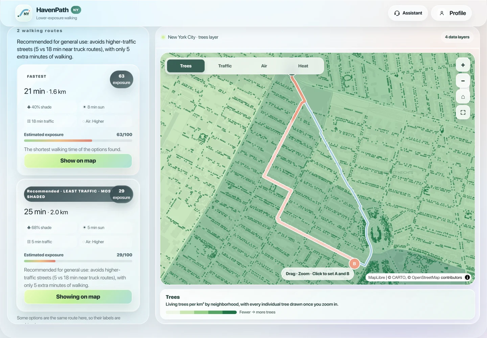
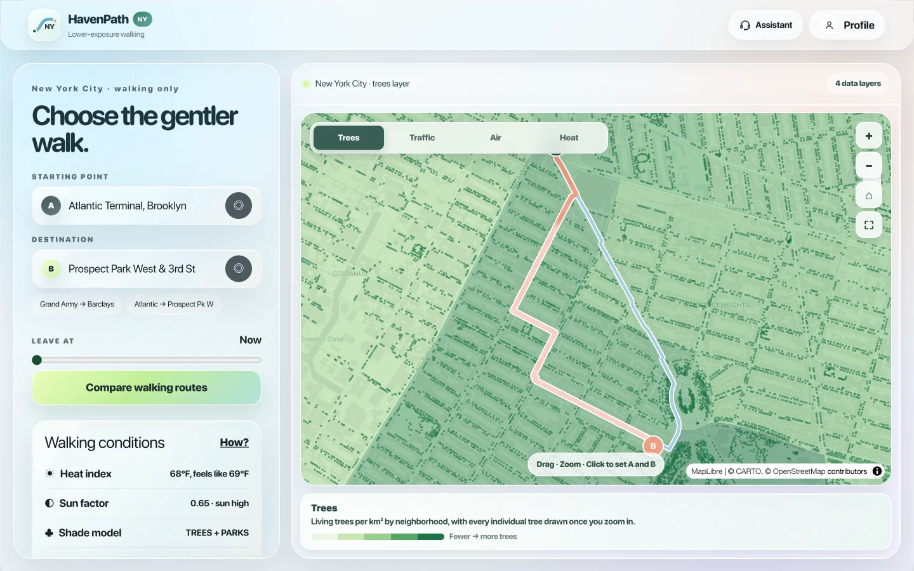
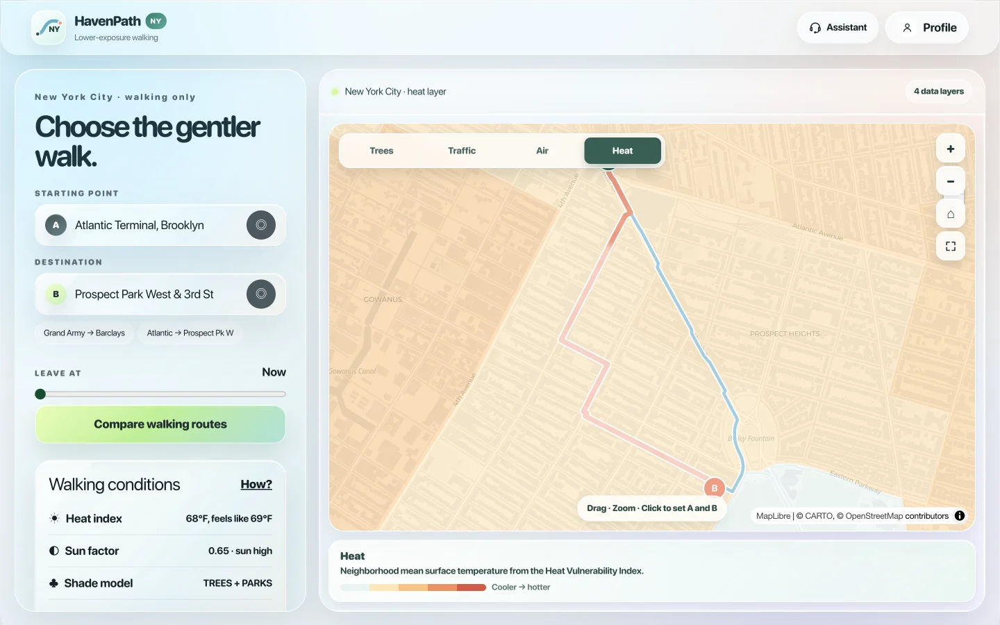
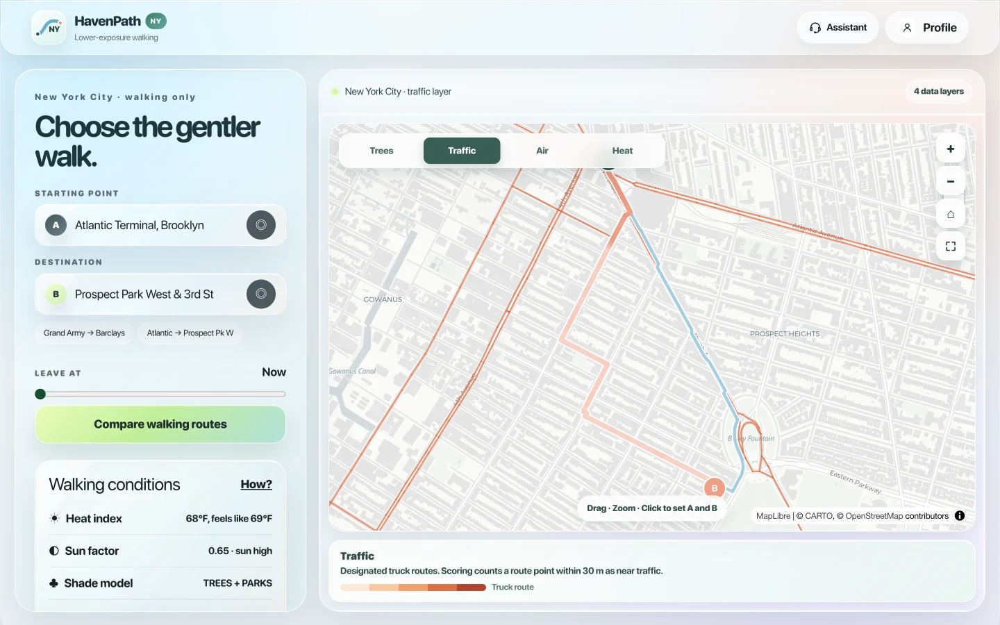
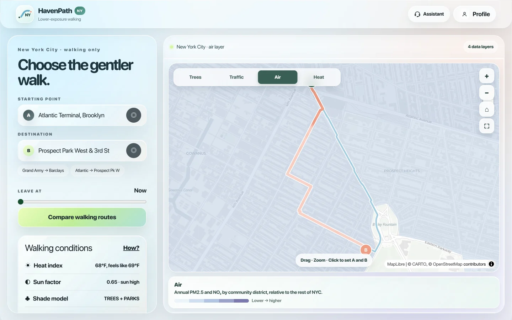
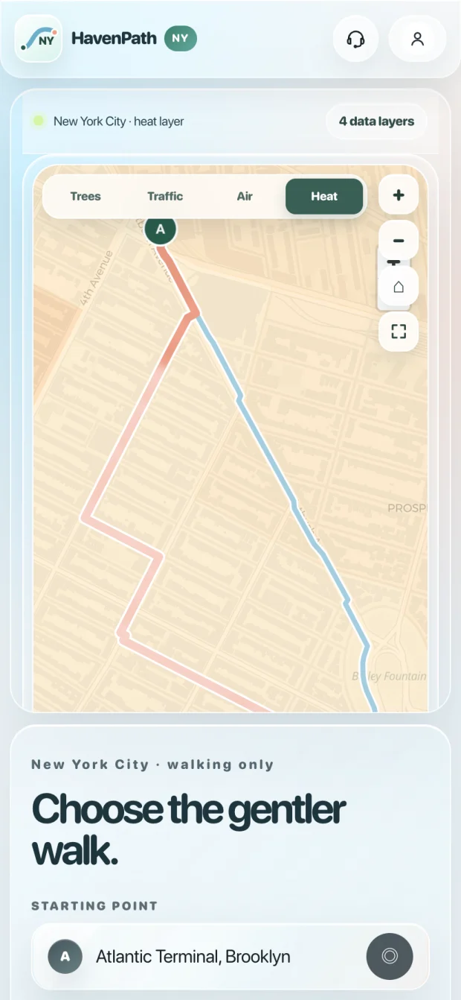
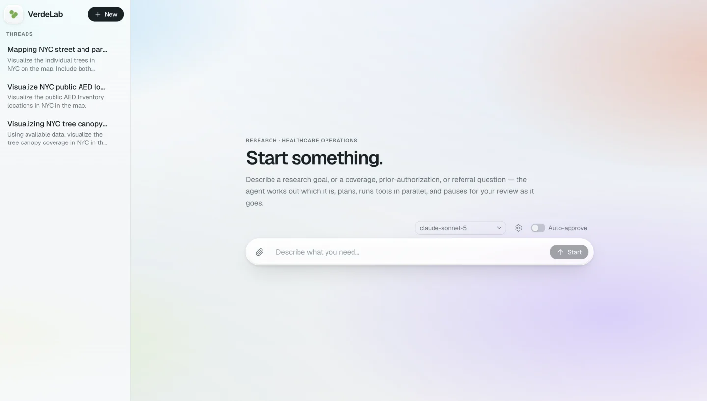
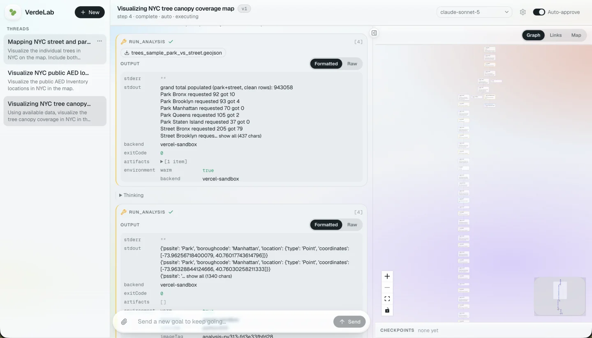
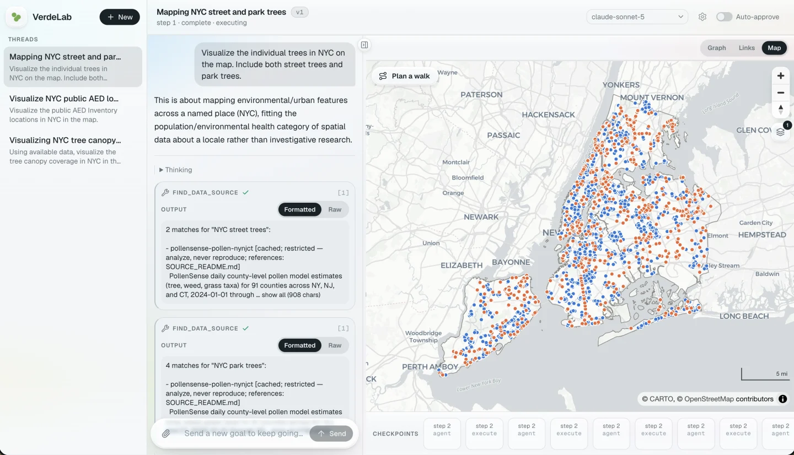
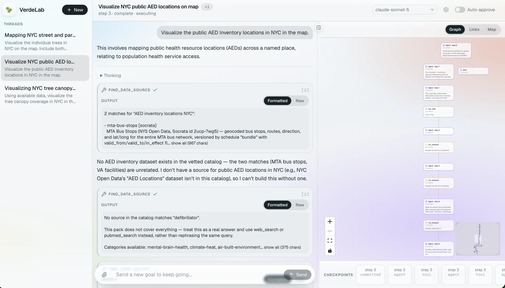

# HavenPath NY

**Two walking routes can take the same time and expose you to very different air, traffic and sun. HavenPath NY shows you the difference before you leave.**

Climate-resilient urban walking navigation · New York City · built on NYC Open Data

📊 **[Pitch deck](docs/HavenPath-NY-pitch-deck.pdf)** · 📄 **[How it works](docs/HOW-IT-WORKS.md)**



---

## The idea

Every map app answers one question: *what is fastest?* For a lot of people that is the wrong question.

Current mapping tools do nothing to protect pedestrians from climate hazards, and offer no adaptation at all for people with specific health conditions. If you have asthma, twenty minutes beside a truck route is not the same as twenty minutes on a side street. If you are elderly, or pushing a stroller in August, a sunny sidewalk and a shaded one are not the same walk. That difference is measurable from public data, and no routing app surfaces it.

**Who it's for:** people with climate-sensitive health needs — asthma, heat sensitivity, respiratory conditions, or other individual vulnerabilities.

HavenPath NY plans a walk the way those people actually choose one. It finds several real walking routes between two points, measures what each one exposes you to, and recommends the gentler option — while telling you exactly what it costs you in minutes.

In the screenshot above, the recommended route cuts time spent near truck routes from **18 minutes down to 5** and raises shade from **40% to 68%** — for about five extra minutes of walking.

## What it measures

Every 25 metres along every candidate route, against four public datasets:

| | Layer | What it reads | Source |
|---|---|---|---|
| 🌳 | **Trees** | 888,335 living street and park trees — shade, and how dense it is | [NYC Parks Forestry Tree Points](https://data.cityofnewyork.us/d/hn5i-inap) |
| 🚛 | **Traffic** | Truck routes, as a proxy for heavy vehicle exposure | [NYC DOT Truck Routes](https://data.cityofnewyork.us/d/jjja-shxy) |
| 🌫️ | **Air** | PM2.5 and NO₂ annual means by community district | [NYC Environment & Health Data Portal](https://a816-dohbesp.nyc.gov/IndicatorPublic/) |
| ☀️ | **Heat** | Neighborhood surface temperature, plus live forecast and sun position | [NYC Heat Vulnerability Index](https://github.com/nychealth/EHDP-data/tree/production/key-topics/heat-vulnerability-index) |

Each one is a map layer you can switch between, so you can see the city the route planner sees:

| Trees | Heat |
|---|---|
|  |  |
| **Traffic** | **Air** |
|  |  |

Zoom in on the tree layer and every individual tree is drawn — all 888,335 of them, served from pre-built binary tiles.

## It ranks for *you*, not in general

The same two routes should not be recommended to everyone. A profile changes the weighting:

| Profile | Time | Air | Traffic | Sun × heat |
|---|---|---|---|---|
| General | 0.50 | 0.15 | 0.15 | 0.20 |
| Asthma | 0.25 | 0.25 | **0.40** | 0.10 |
| Heat-sensitive | 0.30 | 0.05 | 0.10 | **0.55** |

Set it once and every route is scored against it. The profile lives in your browser's local storage — there is no account, no server, and no password field, because a password that authenticates nothing only teaches people to reuse a real one.

| Profile | Assistant |
|---|---|
|  |  |

The assistant answers from the numbers already on screen — the same `TripResult` the cards render. It is deliberately **not** a language model: for health-adjacent guidance, an answer that can't be traced back to a figure on a card is worse than no answer, so it says what it can't tell you instead of inventing it. It gives no medical advice.

The project's AI work sits in a [companion tool](#project-components), one step earlier in the pipeline.

<p align="center">
  
</p>

## Project components

HavenPath was submitted as two pieces, and the AI is in the first one:

### 1. VerdeLab — the dataset agent

[VerdeLab](https://vra.verdept.com/) is a research agent built by **Weiming He**, one of the team. Give it a goal and it works out what kind of question it is, plans, runs tools in parallel, and pauses for review as it goes. It is how the team searched NYC Open Data for candidate layers, checked their coverage, and decided what was worth scoring against — at research time, not when someone plans a walk.

| The agent | Analysing the tree inventory |
|---|---|
|  |  |

Asked to map every street and park tree in NYC, it found the source, pulled it and plotted the lot — street trees against park trees, from the same Forestry inventory this app scores against:



It also refuses when the data isn't there. Asked to map public AED locations, it searched its catalog, found only unrelated matches, and stopped:

> *No AED inventory dataset exists in the vetted catalog — the two matches (MTA bus stops, VA facilities) are unrelated… so I can't build this without one.*



That is the same rule the app follows: say what you can't answer rather than substitute something close.

### 2. HavenPath NY (this repo)

The routing and scoring app the datasets feed into. Everything here is deterministic: the same trip, profile and departure time always produce the same routes, scores and wording. That is the point. Every number on a card traces to a documented constant in [`score.ts`](src/lib/trip/score.ts), which is what makes [`HOW-IT-WORKS.md`](docs/HOW-IT-WORKS.md) possible to write and possible to argue with.

So "AI-powered" describes how the data got here, not how a route gets ranked.

## Honest about what this is

The app reports **estimated environmental exposure**, not health risk. Every weight, radius and scaling constant is a design judgment, not a value from health research.

Known limits, stated up front:

- **Street-level differences come mainly from trees and truck routes.** Air pollution is a district annual average; surface heat is a neighborhood average. Those two do not vary much between routes a few blocks apart.
- **Shade means trees nearby, not computed shadow.** Building shadows are not modeled.
- **Truck routes mark where heavy vehicles are *allowed*,** not measured traffic volume.
- **Tree pollen is built but switched off.** The code measures allergenic species within 50 m, but pollen travels hundreds of metres and tree sex is unrecorded, so the axis could not be justified. It is disabled behind a flag rather than deleted — see [`features.ts`](src/lib/trip/features.ts).
- **Walking only, NYC only,** by design.

[`docs/HOW-IT-WORKS.md`](docs/HOW-IT-WORKS.md) documents every step, every constant, and every dataset that was considered and rejected.

## Roadmap

With more support, the team would:

- **Validate with the people it is for** — test with people who have asthma, heat sensitivity and other climate-sensitive health needs, and check whether the recommendations meaningfully reduce exposure on everyday trips.
- **Add real-time environmental and accessibility data**, so street-level differences come from more than trees and truck routes.
- **Expand beyond NYC** into a climate-health navigation layer that could plug into existing mapping, transportation, healthcare and public-health platforms.

## Running it

Requires Node 20+ (developed on 22).

```bash
git clone https://github.com/JessicaDJ0807/health-climate-map.git
cd health-climate-map
npm install
npm run dev
```

Open <http://localhost:3000>.

The pre-built data files are committed, so it runs immediately. To regenerate them from NYC Open Data:

```bash
npm run build:trip    # truck routes, air, neighborhood heat
npm run build:trees   # tree tiles + density (~90s, ~1.1M rows)
```

Without `public/data/tree-tiles/`, the app silently falls back to the live Socrata API on every map pan — much slower, and rate limited.

## How it fits together

```
src/
  app/                    Next.js App Router entry, global CSS
  components/trip/
    HavenPlanner.tsx      the whole UI — planner, drawers, modal
    TripMap.tsx           MapLibre map, routes, the four env layers
    useTrip.ts            trip state and the analyse → score pipeline
  lib/trip/
    routing.ts            Valhalla pedestrian routing
    env.ts                dataset loading, tree tiles + fallbacks
    score.ts              all scoring, profiles and weights
    assistant.ts          answers generated from the live result
  styles/haven/           design team's stylesheets, vendored verbatim
scripts/                  data build scripts
docs/HOW-IT-WORKS.md      the full method
```

**Stack:** Next.js 16 · React 19 · MapLibre GL · Valhalla · NYC Open Data

## Data sources

All public, all free, no API keys.

| Source | Used for | ID |
|---|---|---|
| [NYC Parks Forestry Tree Points](https://data.cityofnewyork.us/d/hn5i-inap) | Shade and tree species, updated continuously | `hn5i-inap` |
| [NYC DOT Truck Routes](https://data.cityofnewyork.us/d/jjja-shxy) | Traffic proxy | `jjja-shxy` |
| [2020 Neighborhood Tabulation Areas](https://data.cityofnewyork.us/d/9nt8-h7nd) | Parks and neighborhood boundaries | `9nt8-h7nd` |
| [NYC Environment & Health Data Portal](https://a816-dohbesp.nyc.gov/IndicatorPublic/) ([data](https://github.com/nychealth/EHDP-data)) | PM2.5 and NO₂ by community district | — |
| [NYC Heat Vulnerability Index](https://github.com/nychealth/EHDP-data/tree/production/key-topics/heat-vulnerability-index) | Surface temperature by neighborhood | — |
| [NYC Planning Labs GeoSearch](https://geosearch.planninglabs.nyc/) | Address and building search | — |
| [Photon](https://photon.komoot.io/) | Landmark search ([OpenStreetMap](https://www.openstreetmap.org/)) | — |
| [Valhalla](https://valhalla.openstreetmap.de/) ([project](https://valhalla.github.io/valhalla/)) | Pedestrian routing on OpenStreetMap | — |
| [National Weather Service API](https://www.weather.gov/documentation/services-web-api) | Hourly temperature forecast | — |

Tree inventory snapshot: **2026-09-09** · 888,335 living trees · 321 species.

## Team

Built by **CareBuilders** for the Health in Climate NYC 2026 hackathon.

| | |
|---|---|
| **Zhaoxi Chen** — Design & Technology | Rendered the app and website, including animations, interactions and functionality |
| **Baihe Fu** — Communication Designer | In-app layout, visual formatting and user experience |
| **Jessica Hsiao** — Software Engineer | The web app's decision logic, and wiring the datasets behind route scoring |
| **Lei Hao** — Biomedical Engineer | Healthcare domain input and feature testing |
| **Weiming He** — Computer Engineer | [VerdeLab](https://vra.verdept.com/), the dataset agent — its agent loops and data-fetching pipelines |
