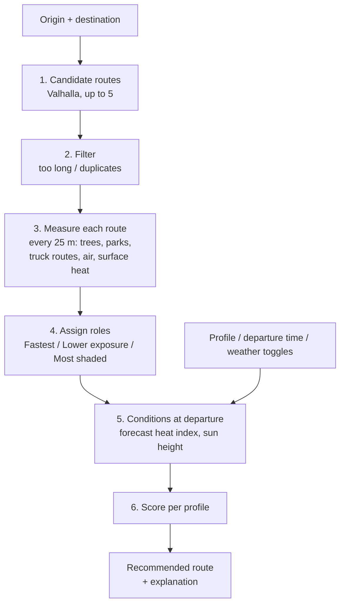

# How Safer Walk NYC picks a route

This document explains how the app finds walking routes, what data it uses,
and how it decides which route to recommend. It is meant for teammates,
reviewers and judges who want to understand — or challenge — the decisions.

The app outputs **estimated environmental exposure**, not health risk. All
weights, distances and scaling constants below are design judgments, not
values taken from health research. Where a value was adjusted after testing,
this document says so.

Code references: routing is in `src/lib/trip/routing.ts`, data loading in
`src/lib/trip/env.ts`, and all scoring in `src/lib/trip/score.ts`.

## Overview

Steps 1–4 run **once per trip**. Steps 5–6 are cheap and re-run instantly
whenever the user changes profile, departure time or weather, which is why the
recommendation updates without reloading.

## Data sources

| Used for | Source | Vintage | How it's loaded |
|---|---|---|---|
| Street network and walking times | OpenStreetMap, via the public Valhalla router (`valhalla1.openstreetmap.de`) | Live | Per trip |
| Address search | NYC Planning Labs GeoSearch | Live | Per keystroke (debounced) |
| Street trees (shade) | NYC Street Tree Census, NYC Open Data `uvpi-gqnh` | 2015 (latest official census; unchanged since 2017) | Pre-built tiles `public/data/tree-tiles/` (living trees only). Fallbacks: live NYC Open Data API, then neighborhood tree density — see Step 3 |
| Large parks (shade) | 2020 Neighborhood Tabulation Areas, NYC Open Data `9nt8-h7nd`, type 9 | 2020 boundaries | Pre-built file `public/data/nta-env.geojson` |
| Traffic proxy | NYC DOT truck routes, NYC Open Data `jjja-shxy` (32,939 segments) | Updated 2026 | Pre-built file `public/data/truck-routes.json` |
| Air pollution | NYC Environment & Health Data Portal (`nychealth/EHDP-data`): PM2.5 (indicator 2023, measure 1425) and NO₂ (indicator 2025, measure 1431), annual means for 59 community districts | 2025 | Pre-built file `public/data/air-by-cd.geojson` |
| Neighborhood surface heat | NYC Heat Vulnerability Index, `SURFACE_TEMP` by 2020 NTA | HVI 2020-NTA release | Pre-built file `public/data/nta-env.geojson` |
| Air-temperature forecast | National Weather Service hourly forecast, grid cell OKX/33,42 (Manhattan), applied citywide | Live | Once per page load |
| Sun position | `suncalc` library | Computed | Per departure time |

Pre-built files are regenerated with `npm run build:trip`
(`scripts/build-trip-data.mjs`); tree tiles and neighborhood tree density with
`npm run build:trees` (`scripts/build-tree-data.mjs`).

## Scope: walking only

The app plans walking trips only — no subway, bus, bike or car legs. This is
deliberate: exposure on those modes (subway platform heat and underground air,
waits at bus stops, cycling exertion) is too variable, and public data for it
is too thin to estimate credibly. The walking factors — trees, truck routes,
sun — are measurable at street level, so the app stays within them.

## Step 1 — Candidate routes

Routing uses **Valhalla**, an open-source routing engine, via the free public
server run on OpenStreetMap data. Every request uses Valhalla's `pedestrian`
costing (walking only: it never uses transit or bikes) with
`type: "foot"` and `use_ferry: 0`, so ferry legs are strongly avoided.

Three requests go to Valhalla at the same time:

| Request | Returns |
|---|---|
| A → B with `alternates: 2` | Valhalla's best route and up to 2 alternatives |
| A → detour point (left) → B | A route pushed to one side of the straight line |
| A → detour point (right) → B | A route pushed to the other side |

**Why detours:** Valhalla's alternatives often overlap almost entirely (in
testing, three Central Park routes differed by 0.1 minutes). Forcing a pass
through a point off to the side produces routes on genuinely different streets.

**Detour point:** at the midpoint of the straight A–B line, offset sideways by
25% of the straight-line distance, clamped to 200–700 m. Valhalla treats it as
a pass-through point, not a stop.

If a detour request fails, it is skipped. If the direct request fails, the app
shows an error.

Walking time is Valhalla's estimate for its default pedestrian speed.

## Step 2 — Filtering candidates

- Drop any route more than **1.5×** the fastest route's time.
- Drop a route if more than **90%** of its points (checked every 30 m) lie
  within **30 m** of a route already kept (near-duplicate).

This leaves 1–5 candidates.

## Step 3 — Measuring each route

Each route is split into points every **25 m**. At each point:

| Measure | Rule |
|---|---|
| Tree shade | Count living street trees within **15 m**. 0 trees → 0, 3+ trees → 1 (full shade), proportional in between. |
| Tree shade (fallback) | Used only if street-level tree locations can't be loaded: the neighborhood's living street trees per km² ÷ 3,000, capped at 1 (calibrated so Park Slope ≈ 64%, close to its street-level value). The app shows a note when this happens. |
| Park shade | If the point is inside a large park (NTA type 9), shade is at least **0.7**. Park trees are not in the street-tree census; without this, a path through Central Park would score as unshaded. |
| Traffic | Is the point within **30 m** of any truck-route segment? (yes/no) |
| Air | PM2.5 and NO₂ of the community district containing the point. |
| Surface heat | Surface temperature of the neighborhood containing the point. |

Route-level values are averages over its points:

- **Shade %** — mean shade value
- **Traffic share** — share of points near a truck route
- **PM2.5, NO₂, surface temperature** — mean values

Points are evenly spaced, so these are distance-weighted averages, which equal
time-weighted averages at a constant walking pace.

*Tuned:* full shade originally needed 2 trees. Every route then scored 65–78%
shaded and routes couldn't be told apart, so it was raised to 3.

## Step 4 — Assigning roles

Roles don't depend on profile or time, so the three cards stay stable while
the user toggles.

- **Fastest** — shortest walking time.
- **Detour allowance** — other roles must be within **35% or 8 minutes** of
  Fastest, whichever is larger.
  *Tuned:* originally a flat 35%. On a 21-minute trip that excluded a route
  with half the traffic exposure at +8 minutes; short trips need an absolute
  allowance.
- **Lower exposure** — lowest air + traffic score (defined in Step 6) within
  the allowance. It must beat Fastest by at least 0.01, otherwise Fastest keeps
  the role.
- **Most shaded** — highest shade % within the allowance. It must beat Fastest
  by more than 1 percentage point.

If one route wins several roles, it is shown once with combined labels (e.g.
"Lower exposure · Most shaded"), so the user sees 1–3 cards instead of
near-duplicates.

## Step 5 — Conditions at departure

| Input | How it's computed |
|---|---|
| Heat index | From the forecast hour within 30 minutes of departure, using the NWS heat-index formula (Rothfusz regression) on temperature and humidity. If no forecast is available, 75°F is assumed. The **Hot day** toggle replaces the forecast with 92°F / feels like 95°F. |
| Sun factor | Sun height above the horizon at the trip midpoint, from `suncalc`. 0 when the sun is down, rising to 1 at 45° or higher: `sin(altitude) / sin(45°)`, clamped to 0–1. |
| Heat factor | `(heat index − 65°F) / 25`, clamped to 0–1.4. So 65°F → 0, 90°F → 1, 95°F → 1.2. |

## Step 6 — Scoring

### Per-route metrics

| Metric | Formula |
|---|---|
| Minutes in sun | minutes × (1 − shade) × sun factor |
| Sun × heat | minutes in sun × (0.25 + heat factor) × (0.85 + 0.3 × surface-heat index) |
| Minutes near traffic | minutes × traffic share |
| Air index | average of PM2.5 and NO₂, each scaled 0–1 between the cleanest and most polluted of the 59 districts |

The surface-heat index scales neighborhood surface temperature 0–1 across NYC,
so hotter neighborhoods add up to +15% to sun × heat and cooler ones up to −15%.

Air and traffic are multiplied by minutes because they represent **total
exposure**: a longer walk through the same air means more exposure. The same
applies to sun: a longer shaded route can still add up to more minutes in sun
than a short unshaded one, and the score reflects that.

### Normalized parts

Each part is divided by a fixed constant so a typical trip lands around 0–1.
The constants are fixed (not relative to the other routes) so that small
differences between routes stay small instead of being stretched.

| Part | Value | Divided by |
|---|---|---|
| Time | walking minutes | 40 |
| Air | air index × minutes | 30 |
| Traffic | minutes near traffic | 12 |
| Heat | sun × heat | 20 |

### Profile weights

Profile score = weighted sum of the four parts. **The lowest score is
recommended.**

| Profile | Time | Air | Traffic | Sun × heat |
|---|---|---|---|---|
| General | 0.5 | 0.15 | 0.15 | 0.2 |
| Asthma | 0.25 | 0.25 | 0.4 | 0.1 |
| Heat-sensitive | 0.3 | 0.05 | 0.1 | 0.55 |

*Tuned:* Asthma started at 0.3 time / 0.3 air / 0.3 traffic. A route with
5 vs 7 minutes near truck routes lost by 0.001, because its longer walk raised
its air total while district air values were nearly identical. Weight moved to
traffic, the factor this data can actually distinguish at street level.

### Values shown on each card

- **Exposure bar (0–100)** — average of the air, traffic and heat parts,
  × 100, capped at 100. It is the same for every profile, so it doesn't change
  when the user switches profiles.
- **Air level** — for each pollutant, NYC's 59 districts are split into thirds;
  the card shows the worse of the two ("Lower", "Moderate" or "Higher than most
  NYC neighborhoods"). This is relative to NYC, not a health threshold.
- **Shade %, minutes near traffic, minutes in sun** — the metrics above.

## Explanation line

- **If the recommendation is Fastest:** the line says the other options don't
  lower estimated exposure enough to justify the extra walk. For
  Heat-sensitive with the sun down, it says shade matters less and the
  fastest route keeps time outdoors shortest.
- **Otherwise:** the traffic, air and heat parts of the recommended route are
  compared with Fastest, each multiplied by the profile's weight. The largest
  improvement becomes the reason:
  - traffic → "avoids higher-traffic streets (X vs Y min near truck routes)"
  - air → "passes through areas with lower average air pollution"
  - heat → "more shade at this hour (X% shaded vs Y% on the fastest route)"

  followed by the extra minutes ("with only 4 extra minutes of walking").

Because the reason is whichever factor differs most, a Heat-sensitive
recommendation can cite traffic when, at that hour, traffic separates the
routes more than shade does.

## Worked example

Atlantic Terminal → Prospect Park West, Hot day, about 5 PM:

| | Fastest | Lower exposure · Most shaded |
|---|---|---|
| Time | 21 min | 25 min (+5) |
| Shade | 26% | 68% |
| Minutes near truck routes | 18 | 5 |
| Minutes in sun | 8 | 4 |
| Air level | Higher | Higher |
| Exposure bar | 76 | 35 |

The fastest route follows Flatbush Avenue — a truck route with few street
trees. The alternative uses tree-lined side streets. Every profile recommends
the alternative. Air is identical because both routes are in the same
community district.

## Wording rules

- Always "estimated environmental exposure"; never "risk", "safe" or "unsafe".
- "Recommended for asthma", not "safe for asthma".
- Air level is relative to NYC neighborhoods, not health thresholds.
- The footer states data years and that the app is not medical advice.

## Known limitations

- **Street-level differences come only from trees and truck routes.** Air
  pollution is a district annual average; air temperature is one citywide
  forecast; surface heat is a neighborhood average.
- **Shade means trees nearby, not measured shadow.** Tree data is from 2015.
  Building shadows are not modeled. In the neighborhood-density fallback,
  routes in the same neighborhoods get similar shade, so shade barely
  separates them.
- **Truck routes are a proxy for traffic.** They mark where heavy vehicles are
  allowed, not measured traffic volumes.
- **Large parks count as 70% shaded**; small parks are not flagged.
- **Walking only** by design (see Scope).
- **Judgment calls.** All weights, radii (15 m, 30 m) and scaling constants.
  Three were tuned after test trips: trees for full shade (2 → 3), the +8 min
  detour allowance, and the Asthma weights. The two sample trips were chosen
  by testing 8 trips and keeping the ones with clear differences.

## Where to change things

| To change | Edit |
|---|---|
| Profile weights, radii, scaling constants, detour allowance | Constants at the top of `src/lib/trip/score.ts` and `PROFILES` |
| Explanation wording | `explain()` in `src/lib/trip/score.ts` |
| Candidate generation (detour offset, duplicate threshold) | `src/lib/trip/routing.ts` |
| Hot-day scenario, sample trips, departure range | `src/components/trip/TripPlanner.tsx` |
| Pre-built data layers | `scripts/build-trip-data.mjs`, then `npm run build:trip` |
