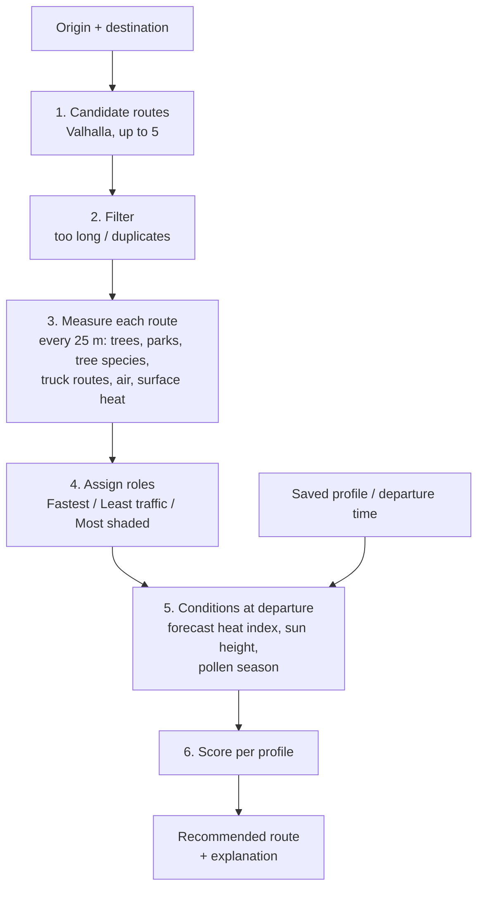

# How HavenPath NY picks a route

This document explains how the app finds walking routes, what data it uses,
and how it decides which route to recommend. It is meant for teammates,
reviewers and judges who want to understand — or challenge — the decisions.

The app outputs **estimated environmental exposure**, not health risk. All
weights, distances and scaling constants below are design judgments, not
values taken from health research. Where a value was adjusted after testing,
this document says so.

Code references: routing is in `src/lib/trip/routing.ts`, data loading in
`src/lib/trip/env.ts`, and all scoring in `src/lib/trip/score.ts`.

This document covers the method only. For what the product is, the interface,
the four map layers and the companion dataset agent, see the
[README](../README.md).

## Overview

Steps 1–4 run **once per trip**. Steps 5–6 are cheap and re-run instantly
whenever the profile or the departure time changes, which is why the
recommendation updates without reloading.

## Data sources

| Used for | Source | Vintage | How it's loaded |
|---|---|---|---|
| Street network and walking times | OpenStreetMap, via the public Valhalla router (`valhalla1.openstreetmap.de`) | Live | Per trip |
| Address and place search | NYC Planning Labs GeoSearch (addresses, buildings) merged with Photon (OpenStreetMap places, for landmarks); clicked points are labeled with the nearest GeoSearch address | Live | Per keystroke (debounced) |
| Street and park trees (shade, species) | NYC Parks Forestry tree inventory, NYC Open Data `hn5i-inap` (~888,000 living trees, with species and trunk diameter) | Maintained continuously; last refresh recorded in `public/data/trees-summary.json` | Pre-built tiles `public/data/tree-tiles/` — Int32 triples of `[lng×1e5, lat×1e5, pollenClass]`, living trees only. Fallbacks: live NYC Open Data API, then neighborhood tree density — see Step 3 |
| Large parks (shade) | 2020 Neighborhood Tabulation Areas, NYC Open Data `9nt8-h7nd`, type 9 | 2020 boundaries | Pre-built file `public/data/nta-env.geojson` |
| Traffic proxy | NYC DOT truck routes, NYC Open Data `jjja-shxy` (32,939 segments) | Updated 2026 | Pre-built file `public/data/truck-routes.json` |
| Air pollution | NYC Environment & Health Data Portal (`nychealth/EHDP-data`): PM2.5 (indicator 2023, measure 1425) and NO₂ (indicator 2025, measure 1431), annual means for 59 community districts | 2025 | Pre-built file `public/data/air-by-cd.geojson` |
| Neighborhood surface heat | NYC Heat Vulnerability Index, `SURFACE_TEMP` by 2020 NTA | HVI 2020-NTA release | Pre-built file `public/data/nta-env.geojson` |
| Air-temperature forecast | National Weather Service hourly forecast, grid cell OKX/33,42 (Manhattan), applied citywide | Live | Once per page load |
| Sun position | `suncalc` library | Computed | Per departure time |

Pre-built files are regenerated with `npm run build:trip`
(`scripts/build-trip-data.mjs`); tree tiles and neighborhood tree density with
`npm run build:trees` (`scripts/build-tree-data.mjs`).

## Scope: walking only

The app plans walking trips only — no subway, bus, bike or car legs. This is
deliberate: exposure on those modes (subway platform heat and underground air,
waits at bus stops, cycling exertion) is too variable, and public data for it
is too thin to estimate credibly. The walking factors — trees, truck routes,
sun — are measurable at street level, so the app stays within them.

## Step 1 — Candidate routes

Routing uses **Valhalla**, an open-source routing engine, via the free public
server run on OpenStreetMap data. Every request uses Valhalla's `pedestrian`
costing (walking only: it never uses transit or bikes) with
`type: "foot"` and `use_ferry: 0`, so ferry legs are strongly avoided.

Three requests go to Valhalla at the same time:

| Request | Returns |
|---|---|
| A → B with `alternates: 2` | Valhalla's best route and up to 2 alternatives |
| A → detour point (left) → B | A route pushed to one side of the straight line |
| A → detour point (right) → B | A route pushed to the other side |

**Why detours:** Valhalla's alternatives often overlap almost entirely (in
testing, three Central Park routes differed by 0.1 minutes). Forcing a pass
through a point off to the side produces routes on genuinely different streets.

**Detour point:** at the midpoint of the straight A–B line, offset sideways by
25% of the straight-line distance, clamped to 200–700 m. Valhalla treats it as
a pass-through point, not a stop.

If a detour request fails, it is skipped. If the direct request fails, the app
shows an error.

Walking time is Valhalla's estimate for its default pedestrian speed.

## Step 2 — Filtering candidates

- Drop any route more than **1.5×** the fastest route's time.
- Drop a route if more than **90%** of its points (checked every 30 m) lie
  within **30 m** of a route already kept (near-duplicate).

This leaves 1–5 candidates.

## Step 3 — Measuring each route

Each route is split into points every **25 m**. At each point:

| Measure | Rule |
|---|---|
| Tree shade | Count living street trees within **15 m**. 0 trees → 0, 3+ trees → 1 (full shade), proportional in between. |
| Tree shade (fallback) | Used only if street-level tree locations can't be loaded: the neighborhood's living trees per km² ÷ 3,400, capped at 1 (calibrated so Park Slope ≈ 64%, close to its street-level value). The app shows a note when this happens. |
| Park shade | If the point is inside a large park (NTA type 9), shade is at least **0.7**. See "Why parks still have a floor" below. |
| Allergenic trees | *Implemented but switched off* — see "Allergenic tree species". Weighted count of trees within **50 m**: wind-pollinated genera count 2, lighter wind-pollinated ones 1, insect-pollinated 0, divided by **40** and capped at 1. |
| Traffic | Is the point within **30 m** of any truck-route segment? (yes/no) |
| Air | PM2.5 and NO₂ of the community district containing the point. PM10 is not used — see "Why no PM10". |
| Surface heat | Surface temperature of the neighborhood containing the point. |

Route-level values are averages over its points:

- **Shade %** — mean shade value
- **Traffic share** — share of points near a truck route
- **PM2.5, NO₂, surface temperature** — mean values

Points are evenly spaced, so these are distance-weighted averages, which equal
time-weighted averages at a constant walking pace.

*Tuned:* full shade originally needed 2 trees. Every route then scored 65–78%
shaded and routes couldn't be told apart, so it was raised to 3.

### Why parks still have a floor

The Forestry inventory **does** include park interiors — Prospect Park holds
5,709 living trees in it, against 168 in the old street-tree census. So the
0.7 floor is no longer standing in for missing data.

It survives for a different reason. Sampling Prospect Park's interior on an
even grid measures only **0.44** shade, because meadows, ballfields and the
lake dilute the average. But routes follow *paths*, and the paths are
tree-lined. Until shade is sampled along paths rather than across area, the
floor stands in for that difference. It is a judgment call, and the measured
0.44 is the honest lower bound.

### Allergenic tree species

> **Not shown in the app.** This axis is fully implemented and tested, but
> `SHOW_POLLEN` in `src/lib/trip/features.ts` is `false`, so nothing below
> reaches the UI and nothing below affects any ranking. It is documented
> because the measurement, the tile format and the Pollen-sensitive profile
> are all still in the code, and because the reasoning for switching it off
> is the useful part. Turning the flag on restores every surface.

The tree inventory records species, so each tree is classed by how its pollen
travels: wind-pollinated genera (oak, planetree, maple, elm, ash, birch,
mulberry) versus insect-pollinated ones (honeylocust, linden, cherry, pear,
pagoda tree). The table lives in `src/lib/trip/pollen-genera.json` and is read
by both the app and the tile builder, so they cannot drift apart.

The split is real, not marginal: across NYC's living trees it is **46% high,
12% moderate, 41% low**, and the city's two most planted street trees sit at
opposite ends of it — London planetree (99,998, wind) and honeylocust (77,424,
insect). On six test corridors it changed which route was recommended on
three of them.

**This is the weakest axis in the app, and it measures species composition
rather than pollen.** Three limits, all structural:

- **Scale mismatch.** Pollen is wind-borne over hundreds of metres to
  kilometres. The 50 m radius captures *which trees you walk past*, not the
  pollen you breathe. Every other axis measures at the scale its mechanism
  operates: a tree 15 m away really does shade this sidewalk.
- **Sex is not recorded.** Male and female trees of the same species differ
  completely, which matters most for maple, ash, ginkgo and poplar. NYC plants
  male ginkgo clones deliberately, so ginkgo is likely under-rated here.
- **No ground truth.** NYC Open Data has no pollen dataset, so the saturation
  constant was calibrated to spread the index across the city (clipping the
  densest 13%, terciles landing at 0.25 and 0.50), not against measurements.
  Season timing is a triangle — zero outside late February to early June,
  peaking mid-April — and real timing varies by species and year.

Supportable claim: *this route passes more allergenic trees than that one.*
Not supportable: *this route exposes you to more pollen.* The gap between
those two is why the axis is off: a health-coded label on an inference chain
with no measurement anywhere in it is the one thing this app should not ship.

### Why no PM10

PM10 (particles up to 10 µm) includes PM2.5 plus coarser particles, mostly
road dust, brake and tire wear, and construction dust. There is no NYC PM10
data that varies by street or neighborhood:

- The Environment & Health Data Portal (our air source) has PM2.5, black
  carbon, NO₂, NO, ozone and SO₂ — no PM10.
- EPA's official network has only **two** NYC PM10 monitors (IS 52 in the
  Bronx, 2025 mean 14.1 µg/m³; Queens College, 12.8 µg/m³), each sampling one
  day in six. Every route would get the same value.
- Low-cost sensor networks report PM10, but their PM10 readings are much less
  reliable than their PM2.5.

Instead, the coarse near-road share of PM10 is approximated by truck-route
proximity, since road dust and brake/tire wear concentrate beside heavy
traffic.

## Considered but not used

These come up often enough to state plainly. **None of them affects any score
today**; the full list of what does is the Data sources table.

| Not used | Why |
|---|---|
| **Construction sites** (e.g. NYC Open Data `8586-3zfm`) | Discussed as a second dust proxy for the Asthma profile, but never added: the dataset hasn't been verified, and it would be another proxy rather than a measurement. |
| **PM10** | No NYC data that varies by street or neighborhood — see "Why no PM10" above. |
| **Building shadows** | Accurate shade would need building footprints and heights with sun geometry; a day of work on its own. Shade comes from trees and parks only. |
| **Measured traffic volumes** | NYC's automated counts cover few locations; truck routes cover the whole city, so they are the proxy. |
| **Transit, cycling, driving** | Out of scope — see "Scope: walking only". |
| **Live air-quality readings** (EPA AirNow) | Needs an API key, and gives one citywide value that can't separate routes. It would only support a "today's air quality" banner. |
| **Forestry Planting Spaces** (NYC Open Data `82zj-84is`) | Evaluated and rejected — see "Forestry Planting Spaces" below. |

### Forestry Planting Spaces

`82zj-84is` is the companion to the tree inventory: 1,091,709 planting
*sites*, each holding at most one tree. It was evaluated for better shade
modeling and rejected, because the fields that would have helped are almost
entirely empty:

| Field | Populated | Of 1,091,709 |
|---|---|---|
| `width` | 2,336 | 0.2% |
| `length` | 1,425 | 0.13% |
| `treeguard` | 22,865 | 2.1% |
| `overheadutilities` | 37,170 | 3.4% |

Bed dimensions would have been a canopy proxy, and overhead wires would have
explained why some streets carry only small-maturing trees — but at 0.2% and
3.4% coverage neither is usable. Meanwhile `dbh` (trunk diameter) on the tree
inventory is populated for **898,134 of 898,204** living trees, 99.99%, and is
a more direct canopy proxy than bed size would have been. That is the upgrade
worth making, and it needs no second dataset.

The one well-populated field is `psstatus`: 945,458 Populated, **139,609
Empty**. Empty beds are a good "where NYC could plant trees" layer for an
advocacy or planning view, but they hold no tree, so they change no route
score. Not loaded.

## Step 4 — Assigning roles

Roles don't depend on profile or time, so the cards stay stable as the profile
and departure time change. There are at most three, and fewer when one route
wins several roles — the labels are then combined onto one card.

- **Fastest** — shortest walking time.
- **Detour allowance** — other roles must be within **35% or 8 minutes** of
  Fastest, whichever is larger.
  *Tuned:* originally a flat 35%. On a 21-minute trip that excluded a route
  with half the traffic exposure at +8 minutes; short trips need an absolute
  allowance.
- **Least traffic** — fewest minutes beside truck routes within the allowance,
  with the air index breaking ties (weighted 0.1). It must beat Fastest by at
  least 0.01, otherwise Fastest keeps the role. The name matches what decides
  it: district air values are usually identical along a single trip, so traffic
  is the factor that separates routes.
  *Renamed:* this role was called "Lower exposure", which didn't say exposure
  to what, and it ranked air and traffic equally despite traffic deciding it in
  practice.
- **Most shaded** — highest shade % within the allowance. It must beat Fastest
  by more than 1 percentage point.

If one route wins several roles, it is shown once with combined labels (e.g.
"Least traffic · Most shaded"), so the user sees 1–3 cards instead of
near-duplicates.

## Step 5 — Conditions at departure

| Input | How it's computed |
|---|---|
| Heat index | From the forecast hour within 30 minutes of departure, using the NWS heat-index formula (Rothfusz regression) on temperature and humidity. If no forecast is available, 75°F is assumed. A hot-day scenario (92°F, feels like 95°F) exists in `useTrip.ts` as `HOT_DAY`, but no control currently exposes it — `weather` is always `"forecast"`. |
| Sun factor | Sun height above the horizon at the trip midpoint, from `suncalc`. 0 when the sun is down, rising to 1 at 45° or higher: `sin(altitude) / sin(45°)`, clamped to 0–1. |
| Heat factor | `(heat index − 65°F) / 25`, clamped to 0–1.4. So 65°F → 0, 90°F → 1, 95°F → 1.2. |
| Pollen season | *Switched off.* Would be 0 outside roughly late February to early June, rising to 1 at a mid-April peak. |

## Step 6 — Scoring

### Per-route metrics

| Metric | Formula |
|---|---|
| Minutes in sun | minutes × (1 − shade) × sun factor |
| Sun × heat | minutes in sun × (0.25 + heat factor) × (0.85 + 0.3 × surface-heat index) |
| Minutes near traffic | minutes × traffic share |
| Air index | average of PM2.5 and NO₂, each scaled 0–1 between the cleanest and most polluted of the 59 districts |
| Minutes beside allergenic trees | *Switched off.* minutes × allergenic-tree index × pollen season |

The surface-heat index scales neighborhood surface temperature 0–1 across NYC,
so hotter neighborhoods add up to +15% to sun × heat and cooler ones up to −15%.

Air and traffic are multiplied by minutes because they represent **total
exposure**: a longer walk through the same air means more exposure. The same
applies to sun: a longer shaded route can still add up to more minutes in sun
than a short unshaded one, and the score reflects that.

### Normalized parts

Each part is divided by a fixed constant so a typical trip lands around 0–1.
The constants are fixed (not relative to the other routes) so that small
differences between routes stay small instead of being stretched.

| Part | Value | Divided by |
|---|---|---|
| Time | walking minutes | 40 |
| Air | air index × minutes | 30 |
| Traffic | minutes near traffic | 12 |
| Heat | sun × heat | 20 |
| Allergenic trees *(off)* | minutes beside allergenic trees | 20 |

### Profile weights

Profile score = weighted sum of the four parts. **The lowest score is
recommended.**

| Profile | Time | Air | Traffic | Sun × heat |
|---|---|---|---|---|
| General | 0.5 | 0.15 | 0.15 | 0.2 |
| Asthma | 0.25 | 0.25 | 0.4 | 0.1 |
| Heat-sensitive | 0.3 | 0.05 | 0.1 | 0.55 |

Weights sum to 1 within each profile. A fourth profile, Pollen-sensitive, is
defined in the code but hidden along with its axis.

*Tuned:* Asthma started at 0.3 time / 0.3 air / 0.3 traffic. A route with
5 vs 7 minutes near truck routes lost by 0.001, because its longer walk raised
its air total while district air values were nearly identical. Weight moved to
traffic, the factor this data can actually distinguish at street level.

Asthma briefly carried a 0.1 allergenic-tree weight, on the grounds that
allergic asthma is the most common phenotype. It came back out when that axis
was hidden: a weight the user cannot see is a weight they cannot question, and
it would have ranked routes on a factor absent from every card.

### Choosing a profile

The profile saved on the device picks this
(`useDeviceProfile.ts`, local only — no account, nothing sent anywhere):
asthma → Asthma, heat sensitivity or a high shade preference → Heat-sensitive,
otherwise General. With nothing saved, every trip is scored as General.

Earlier builds had a row of profile chips on the planner that overrode this per
trip. They were removed, so the Profile drawer is now the only way to change
it — `changeProfile()` is called from exactly one place,
`HavenPlanner.tsx`, in response to the saved profile.

### Values shown on each card

- **Exposure bar (0–100)** — average of the air, traffic and heat parts,
  × 100, capped at 100. It is the same for every profile, so it doesn't change
  when the user switches profiles.
- **Air level** — for each pollutant, NYC's 59 districts are split into thirds;
  the card shows the worse of the two ("Lower", "Moderate" or "Higher than most
  NYC neighborhoods"). This is relative to NYC, not a health threshold.
- **Shade %, minutes near traffic, minutes in sun** — the metrics above.

## Explanation line

- **If the recommendation is Fastest:** the line says the other options don't
  lower estimated exposure enough to justify the extra walk. For
  Heat-sensitive with the sun down, it says shade matters less and the
  fastest route keeps time outdoors shortest.
- **Otherwise:** the traffic, air and heat parts of the recommended route are
  compared with Fastest, each multiplied by the profile's weight. The largest
  improvement becomes the reason:
  - traffic → "avoids higher-traffic streets (X vs Y min near truck routes)"
  - air → "passes through areas with lower average air pollution"
  - heat → "more shade at this hour (X% shaded vs Y% on the fastest route)"

  followed by the extra minutes ("with only 4 extra minutes of walking").

Because the reason is whichever factor differs most, a Heat-sensitive
recommendation can cite traffic when, at that hour, traffic separates the
routes more than shade does.

## Worked example

Atlantic Terminal → Prospect Park West, Hot day, about 5 PM:

| | Fastest | Least traffic · Most shaded |
|---|---|---|
| Time | 21 min | 25 min (+5) |
| Shade | 26% | 68% |
| Minutes near truck routes | 18 | 5 |
| Minutes in sun | 8 | 4 |
| Air level | Higher | Higher |
| Exposure bar | 76 | 35 |

The fastest route follows Flatbush Avenue — a truck route with few street
trees. The alternative uses tree-lined side streets. Every profile recommends
the alternative. Air is identical because both routes are in the same
community district.

## Wording rules

- Always "estimated environmental exposure"; never "risk", "safe" or "unsafe".
- "Recommended for asthma", not "safe for asthma".
- Air level is relative to NYC neighborhoods, not health thresholds.
- Tree species are not scored today. If the axis is ever shown: "passes more
  allergenic trees", never "more pollen exposure" — the data supports a claim
  about what you walk past, not about what you breathe.
- The footer states data years and that the app is not medical advice.

## Known limitations

- **Street-level differences come only from trees and truck routes.** Air
  pollution is a district annual average; air temperature is one citywide
  forecast; surface heat is a neighborhood average.
- **Shade means trees nearby, not measured shadow.** Building shadows are not
  modeled. In the neighborhood-density fallback, routes in the same
  neighborhoods get similar shade, so shade barely separates them.
- **Tree pollen is not scored.** The axis exists in the code but is switched
  off: it measures species composition within 50 m while pollen travels
  hundreds of metres, tree sex is unrecorded, and there is no NYC pollen data
  to validate against. See "Allergenic tree species".
- **Truck routes are a proxy for traffic.** They mark where heavy vehicles are
  allowed, not measured traffic volumes. They also stand in for near-road
  coarse particles (PM10), which have no street-level data.
- **Large parks count as at least 70% shaded**; an even sample of Prospect
  Park's interior measures 0.44. Small parks are not flagged.
- **Walking only** by design (see Scope).
- **Judgment calls.** All weights, radii (15 m, 30 m) and scaling constants.
  Tuned after test trips: trees for full shade (2 → 3), the +8 min detour
  allowance, and the Asthma weights. The two sample trips were chosen
  by testing 8 trips and keeping the ones with clear differences.

## Where to change things

| To change | Edit |
|---|---|
| Profile weights, radii, scaling constants, detour allowance | Constants at the top of `src/lib/trip/score.ts` and `PROFILES` |
| Explanation wording | `explain()` in `src/lib/trip/score.ts` |
| Candidate generation (detour offset, duplicate threshold) | `src/lib/trip/routing.ts` |
| Hot-day scenario, sample trips, departure range | `src/components/trip/useTrip.ts` |
| Show the allergenic-tree axis again | `SHOW_POLLEN` in `src/lib/trip/features.ts` (also restore Asthma's 0.1 pollen weight) |
| Which genera count as allergenic | `src/lib/trip/pollen-genera.json` (then `npm run build:trees`) |
| Pollen season window, level thresholds | `src/lib/trip/pollen.ts` |
| Assistant answers | `src/lib/trip/assistant.ts` — generated from the scored routes, so it always quotes the same numbers as the cards |
| Map environmental layers | `src/components/trip/envLayers.ts` |
| Pre-built data layers | `scripts/build-trip-data.mjs`, then `npm run build:trip` |
| Tree tiles and neighborhood tree stats | `scripts/build-tree-data.mjs`, then `npm run build:trees` |
